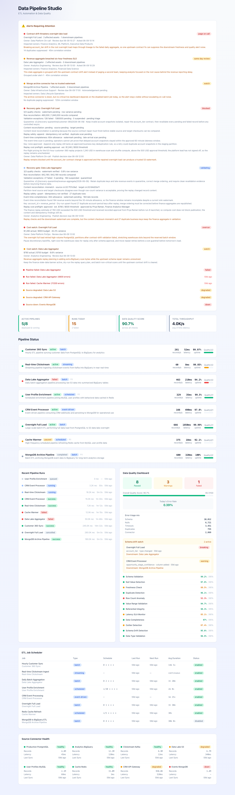
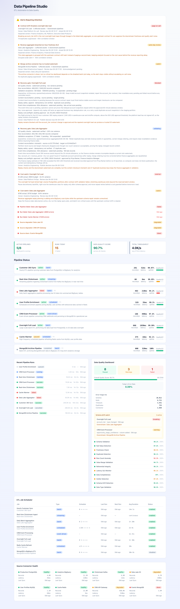
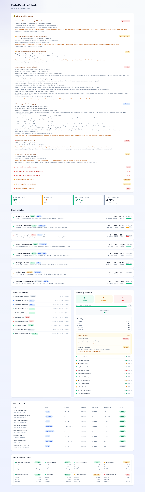

# Data Pipeline Studio

ETL automation, data quality monitoring, real-time processing, and pipeline observability for data engineering teams.

## Overview

Data Pipeline Studio is a comprehensive dashboard for managing and monitoring data pipelines across your organization. It provides real-time visibility into pipeline health, data quality metrics, ETL job scheduling, and source connector status.

## Features

- **Pipeline Status Grid**: Monitor all pipelines with status, throughput, latency, and uptime
- **Run Timeline**: Track recent pipeline runs with success/failure status and performance metrics
- **Data Quality Dashboard**: View quality checks with pass/warn/fail indicators and score tracking
- **ETL Job Scheduler**: Manage batch, streaming, scheduled, and event-driven ETL jobs
- **Source Connector Health**: Monitor source connectors (Postgres, BigQuery, Kafka, S3, MySQL, Redis, API, MongoDB)
- **Alert Panel**: Real-time alerts for failed pipelines, failed runs, and degraded sources

## Screenshots

| Screenshot | Description |
|---|---|
|  | Alerts requiring attention with contract drift and SLO breaches |
|  | Pipeline status grid with active, running, and failed pipelines |
|  | Run timeline and data quality dashboard with check metrics |
|  | ETL job scheduler with batch and streaming job types |
|  | Source connector health with latency and sync status |
|  | Full data pipeline studio dashboard with all metrics |
|  | Full-page portfolio demo screenshot |

## Demo Data

The demo includes:

- **8 pipelines** covering batch ETL, streaming, scheduled, and event-driven workloads
- **15 pipeline runs** with various statuses (success, failed, running, queued, cancelled)
- **12 data quality checks** with pass/warn/fail statuses and threshold comparisons
- **8 source connectors** with health status and performance metrics
- **8 ETL jobs** with schedules and duration tracking

## Getting Started

```bash
# Install dependencies
npm install

# Run development server
npm run dev

# Run tests
npm test

# Type check
npm run typecheck

# Build for production
npm run build
```

Open [http://localhost:3000](http://localhost:3000) in your browser.

## Tech Stack

- **Framework**: Next.js 15 (App Router)
- **Language**: TypeScript
- **Styling**: Tailwind CSS
- **Testing**: Vitest
- **UI Components**: Custom (Badge, Card, ProgressBar, StatusDot, StatCard)

## Project Structure

```
src/
  app/
    layout.tsx          # Root layout with metadata
    page.tsx            # Main dashboard page
    globals.css         # Global styles
  components/
    ui.tsx              # Reusable UI components
  lib/
    types.ts            # TypeScript type definitions
    demo-data.ts        # Demo data and metrics computation
tests/
  pipeline.test.ts      # 10 unit tests
```
